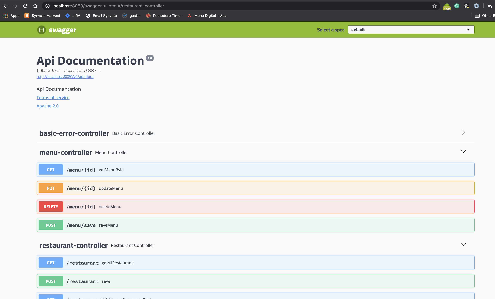

# Menu Project

Abaixo esta o DER inicial, bem basico, com o minimo de informacao.
  

# Rest APIs
A documentacao das APIS se encontram no caminho http://localhost:8080/swagger-ui.html.
A API Basic Error Controller foi criada pelo swagger e alguns models nao sao entidades de fato, depois verei como remove-los da documentacao mas a principio parece suficiente pra auxiliar a criacao das uis.

