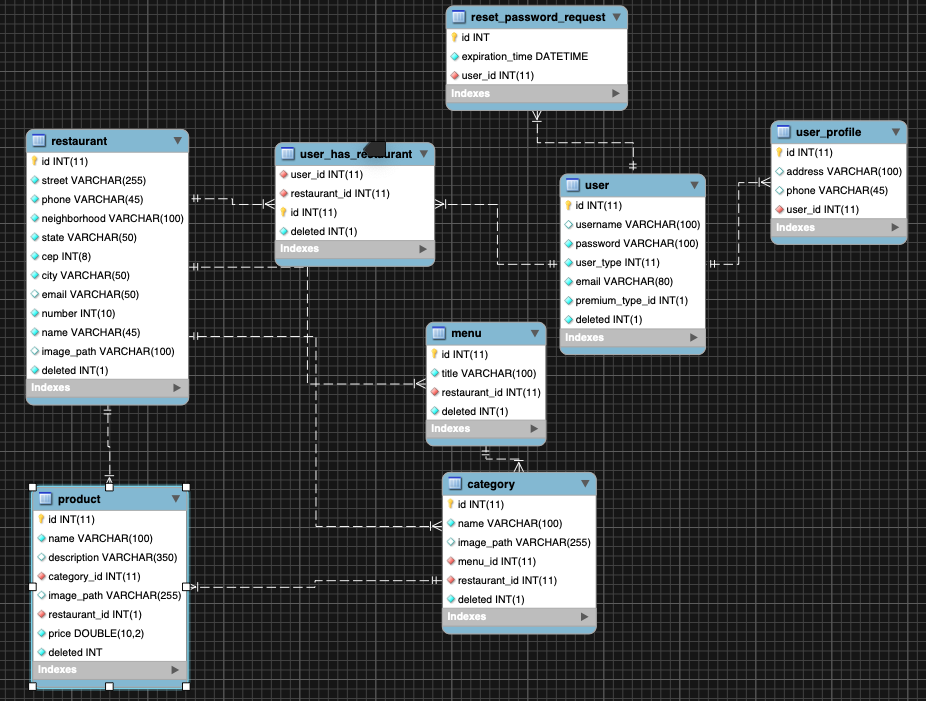

# Menu Project

Abaixo esta o DER inicial, bem basico, com o minimo de informacao.
  

# Rest APIs
A documentacao das APIS se encontram no caminho http://localhost:8080/swagger-ui.html.
A API Basic Error Controller foi criada pelo swagger e alguns models nao sao entidades de fato, depois verei como remove-los da documentacao mas a principio parece suficiente pra auxiliar a criacao das uis.

# Running JAR file

Sempre que houver um commit, irei gerar um jar e colocar na pasta "gitHubFiles". Para executar o jar sera necessario ter o Java 8 instalado (jre) e abrir o terminal na pasta do em que esta o jar e executar o seguinte comando:
java -jar <nome do arquivo>.jar
  

Apos isso basta acessar a URL http://localhost:8080/swagger-ui.html para ver a documentacao das apis disponiveis.
